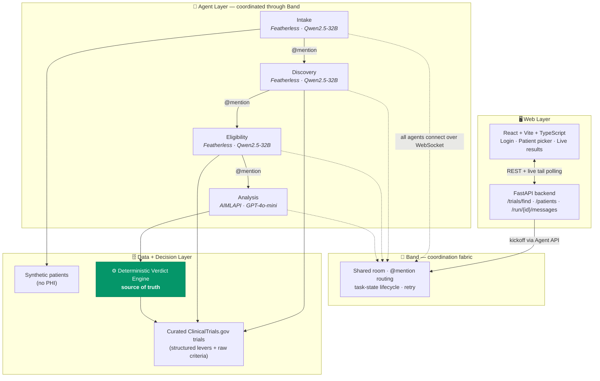
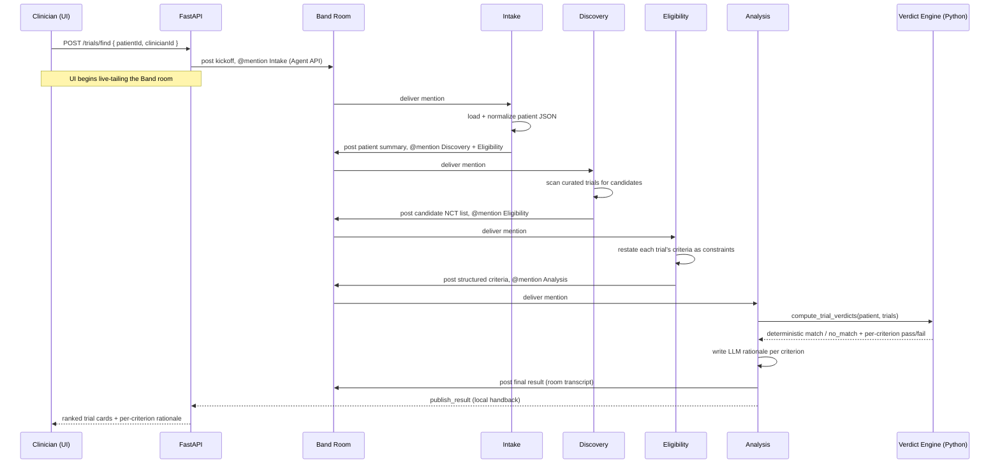
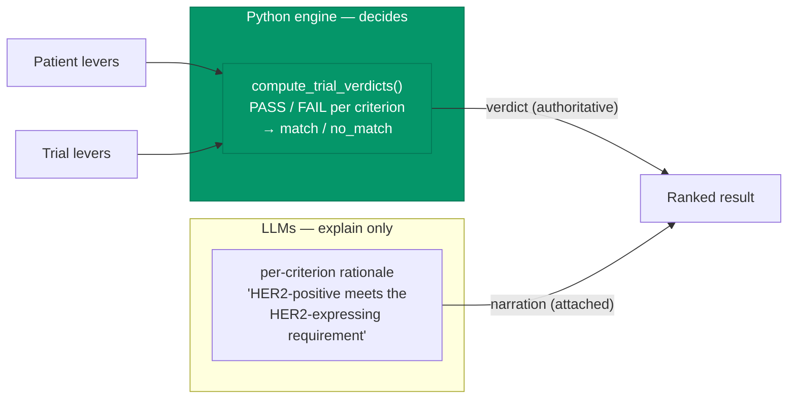

# Clinical Trials

> Multi-agent clinical trial matching where **the agents explain and a deterministic engine decides.**

A multi-agent system that matches metastatic breast-cancer patients to recruiting clinical trials. Four specialized AI agents coordinate through **[Band](https://www.band.ai/)** as a single team — they read the patient, scan the trials, interpret eligibility criteria, and narrate their reasoning in plain clinical language. Crucially, the **match / no-match verdict is computed deterministically in Python, never by a language model.** The LLMs explain; they can never change a pass/fail.

Built for the **Band of Agents Hackathon** · **Track 3: Regulated & High-Stakes Workflows**.

**Stack:** Band SDK · Featherless · AI/ML API · LangGraph · FastAPI · React + TypeScript · ClinicalTrials.gov v2 API

> ⚠️ **Disclaimer:** This is a demonstration project. It uses **real trial data** from ClinicalTrials.gov but **100% synthetic patients — no real PHI**. It is **not** intended or validated for real clinical use.

---

## Table of Contents

- [The core idea](#the-core-idea)
- [System architecture](#system-architecture)
- [The four agents](#the-four-agents)
- [End-to-end flow](#end-to-end-flow)
- [How Band is used](#how-band-is-used)
- [The determinism guarantee](#the-determinism-guarantee)
- [Data layer](#data-layer)
- [Tech stack](#tech-stack)
- [Repository structure](#repository-structure)
- [Setup & installation](#setup--installation)
- [Running the system](#running-the-system)
- [Verifying it works](#verifying-it-works)
- [Operational notes & known limitations](#operational-notes--known-limitations)
- [Roadmap](#roadmap)
- [License & acknowledgements](#license--acknowledgements)

---

## The core idea

Matching a cancer patient to clinical trials is a dense, manual coordination problem. A single trial carries dozens of inclusion/exclusion criteria — receptor status, ECOG, prior therapy lines, labs, washout windows. Recruitment routinely slips timelines, and only a small fraction of eligible patients are ever screened against the full set of open trials.

The naive fix — *let an LLM decide eligibility* — is unsafe. LLMs hallucinate, and a fabricated "match" in oncology is a clinical risk, not a UX bug.

**Clinical Trials** resolves this with one architectural principle:

| | Who does it | Why |
|---|---|---|
| **Reasoning & explanation** | The LLM agents | Models are good at reading messy criteria and explaining in clinical language |
| **The actual verdict (pass/fail)** | A deterministic Python engine | Same patient in → same verdict out, every run; verifiable offline; impossible to hallucinate |

The LLMs phrase the reasoning — *"HER2-positive matches the trial's HER2-expressing requirement"* — but the verdict itself is computed from structured trial levers in code. This is what makes agentic AI safe enough to demonstrate in a regulated workflow.

---

## System architecture



Three layers, cleanly separated:

1. **Web layer** — a clinician logs in, picks a patient, and watches the match happen live. React frontend + FastAPI backend.
2. **Agent layer** — four specialized agents, each an independent process, coordinating through Band via `@mention` handoffs. Three run on Featherless (open-weight Qwen2.5-32B); one runs on AI/ML API (GPT-4o-mini).
3. **Data + decision layer** — curated real trials, synthetic patients, and the deterministic verdict engine that is the single source of truth for every pass/fail.

---

## The four agents

A pipeline of specialists, not one do-everything model. Each agent has a narrow job and its own system prompt.

| Agent | Brain | Responsibility |
|---|---|---|
| **Intake** | Featherless · `Qwen2.5-32B-Instruct` | Loads and normalizes the patient profile — subtype, receptor status, ECOG, labs, prior therapies — and posts a clean structured summary to the room. |
| **Discovery** | Featherless · `Qwen2.5-32B-Instruct` | Scans the curated trial set against the patient and posts the candidate trials worth checking. |
| **Eligibility** | Featherless · `Qwen2.5-32B-Instruct` | Restates each candidate trial's free-text eligibility criteria into structured, comparable constraints. |
| **Analysis** | AI/ML API · `gpt-4o-mini` | Calls the **deterministic verdict tool**, writes a one-line clinical rationale per criterion, and publishes the final ranked result. |

> 🔒 The **Analysis** agent computes the verdict by calling `compute_trial_verdicts()` (which reuses the same deterministic logic as the offline baseline matcher). The model writes the *rationale*; it never writes the *verdict*.

---

## End-to-end flow



Every arrow between agents is a real Band message. The dashboard live-tails the room, so the clinician watches the agents coordinate in real time, then sees the ranked results render once the run completes.

---

## How Band is used

Band is the **coordination fabric**, not a thin wrapper. Concretely:

- **Role specialization & membership** — each agent is an independent process with its own Band identity (agent UUID + key). Band manages who is in the room for every run.
- **Task handoffs** — agents pass work forward with `band_send_message`, `@mentioning` the next agent by handle; Band routes the message to the right inbox.
- **Shared context** — the Band room is the shared workspace; the running transcript is what every agent reads from. Each handoff also carries a self-contained, restated patient context, so there is no shared memory to corrupt.
- **Dynamic connection** — agents subscribe to room events over WebSocket and join a room the moment they are added — no restart — resolving each other by `@handle`.
- **Task-state lifecycle** — Band tracks each message `pending → processing → processed / failed`, with retry. This is what lets the pipeline ride out transient model rate limits.

**Implementation notes (real deltas discovered while building against `band-sdk 1.0.0`):**

- The SDK package imports as `band` (`from band import Agent`, `from band.adapters import LangGraphAdapter`).
- The send tool is `band_send_message`; `mentions` is a non-empty list of handles.
- The orchestrator drives the room through the **Agent API** (`/api/v1/agent/chats/{room}/messages`) using an agent key. The Human API is plan-gated.
- An agent's REST message listing only returns messages that mention it; the final result is returned to the app via a local `publish_result` handback while the full conversation still flows through Band.

---

## The determinism guarantee

This is the heart of the project.



- **Verdicts are deterministic.** The same patient always yields the same lanes, verifiable against an offline rules engine (`baseline_matcher.py`).
- **The model is never given the decision.** It is not "overridden" by a reviewer — the verdict is computed in code and the model is only ever asked to explain it. The guardrail is architectural.
- **The CLI proves it.** `trialsync match` (pure offline engine) and `trialsync match-agents` (full Band pipeline) return the **same lanes** for every patient. If they ever diverge, the determinism rule has been broken.

---

## Data layer

**Disease scope:** Stage IV (metastatic) breast cancer — chosen because biomarker subtypes (HR+/HER2−, HER2+, triple-negative) directly gate trial eligibility, which makes one patient route differently across trials.

### Real trials (from the ClinicalTrials.gov v2 API)

| NCT ID | Subtype gate | Notes |
|---|---|---|
| **NCT06207734** | HR+ / HER2− on a CDK4/6 inhibitor with durable control | CDK4/6 inhibitor discontinuation study |
| **NCT04360941** | Triple-negative + AR-positive | PAveMenT (Palbociclib + Avelumab) |
| **NCT06157892** | HER2-expressing (HER2+ or HER2-low) | Disitamab Vedotin combination |

Trials are fetched once via `fetch_trials.py`, saved locally, and their criteria hand-encoded into structured **levers** (the verbatim eligibility text is kept in `rawCriteria`). No live ClinicalTrials.gov call happens at match time.

### Synthetic patients (no PHI)

| Patient | Profile | Expected result |
|---|---|---|
| **P001** | ER+ PR+ HER2-zero, on palbociclib with durable control, ECOG 1 | **MATCH** → NCT06207734 |
| **P002** | Triple-negative but AR-negative, HER2-zero, ECOG 3 | **NO_MATCH** (all three) |
| **P003** | ER+ / HER2-positive, ECOG 1 | **MATCH** → NCT06157892 |

The matcher returns two lanes: `match` and `no_match`. Verdicts use a fixed reference date so washout-window logic stays deterministic across runs.

---

## Tech stack

| Layer | Technology |
|---|---|
| Coordination | **Band SDK** (`band-sdk 1.0.0`) |
| Reasoning agents | **Featherless** — `Qwen2.5-32B-Instruct` (open-weight) |
| Analysis agent | **AI/ML API** — `gpt-4o-mini` |
| Agent runtime | **LangGraph** adapter (LangChain ecosystem) |
| Backend | **FastAPI** + Uvicorn |
| Frontend | **React + Vite + TypeScript + Tailwind** |
| Data validation | **Pydantic** |
| Trial data | **ClinicalTrials.gov v2 API** |
| Tooling | **uv** (env + deps) |

---

## Repository structure

```
clinical-trials/
├── data/
│   ├── trials/
│   │   ├── raw/                  # raw ClinicalTrials.gov API JSON (one per NCT)
│   │   └── curated.json          # normalized trials: structured levers + rawCriteria
│   ├── patients/                 # synthetic patient profiles (P001, P002, P003)
│   ├── knowledge/
│   │   └── biomarkers.json        # plain-language biomarker fact sheet
│   ├── clinicians/
│   │   └── clinicians.json        # mock clinician identities (for display)
│   └── cache/
│       └── runs/                  # cached run transcripts (demo mode)
├── src/trialsync/
│   ├── schema.py                  # Pydantic models + lever vocabulary
│   ├── fetch_trials.py            # seeds real trials from ClinicalTrials.gov (run once)
│   ├── baseline_matcher.py        # DETERMINISTIC verdict engine (source of truth)
│   ├── brains.py                  # ChatOpenAI factory per provider
│   ├── agent_tools.py             # LangChain tools incl. compute_trial_verdicts, publish_result
│   ├── agent_common.py            # shared agent runner
│   ├── agents/
│   │   ├── intake.py
│   │   ├── discoverer.py
│   │   ├── parser.py
│   │   └── analyzer.py
│   ├── run_agents.py              # orchestrator (kickoff via Agent API, await result)
│   ├── api.py                     # FastAPI backend
│   └── cli.py                     # `match`, `match-agents`, `serve`
├── prompts/                       # one system prompt per agent
├── frontend/                      # React + Vite + TypeScript + Tailwind
├── scripts/
│   ├── start_agents.ps1           # launch the 4 agents (Windows)
│   └── start_agents.sh            # launch the 4 agents (Unix)
├── agent_config.yaml              # model ids + agent id references
├── .env                           # secrets (gitignored)
├── SETUP.md
└── README.md
```

---

## Setup & installation

### Prerequisites

- **Python 3.11+** and **[uv](https://docs.astral.sh/uv/)**
- **Node.js 18+** (for the frontend)
- A **[Band](https://band.ai/)** account
- A **Featherless** API key and an **AI/ML API** key

### 1. Band setup (one-time)

1. Create a Band account and a **REST API key**.
2. Register **four remote agents** (Agents → *Connect Remote Agent*). Save each agent's **UUID** and **API key**:
   - `trialsync-intake`, `trialsync-parser`, `trialsync-discoverer`, `trialsync-analyzer`
3. Create a **chat room/session**, add all four agents, and copy the **room ID** from the URL.

> The Model Providers section in Band Settings is **not** required — the agents call Featherless and AI/ML API directly from code.

### 2. Environment variables

Create `.env` at the repo root (this file is gitignored — **never commit real keys**):

```bash
# ----- Band -----
BAND_API_KEY=band_u_xxxxxxxxxxxxxxxxxxxxxxxx
BAND_ROOM_ID=xxxxxxxx-xxxx-xxxx-xxxx-xxxxxxxxxxxx

# ----- Agent IDs + keys -----
BAND_AGENT_ID_INTAKE=...
BAND_AGENT_KEY_INTAKE=band_a_xxxxxxxxxxxx
BAND_AGENT_ID_PARSER=...
BAND_AGENT_KEY_PARSER=band_a_xxxxxxxxxxxx
BAND_AGENT_ID_DISCOVERER=...
BAND_AGENT_KEY_DISCOVERER=band_a_xxxxxxxxxxxx
BAND_AGENT_ID_ANALYZER=...
BAND_AGENT_KEY_ANALYZER=band_a_xxxxxxxxxxxx

# ----- Agent handles (for @mentions) -----
HANDLE_INTAKE=@youruser/trialsync-intake
HANDLE_PARSER=@youruser/trialsync-parser
HANDLE_DISCOVERER=@youruser/trialsync-discoverer
HANDLE_ANALYZER=@youruser/trialsync-analyzer

# ----- Model providers (OpenAI-compatible endpoints) -----
FEATHERLESS_API_KEY=...
FEATHERLESS_BASE_URL=https://api.featherless.ai/v1

AIML_API_KEY=...
AIML_BASE_URL=https://api.aimlapi.com/v1
```

`agent_config.yaml` holds the model ids:

```yaml
agents:
  intake:      { provider: featherless, model: Qwen/Qwen2.5-32B-Instruct }
  discoverer:  { provider: featherless, model: Qwen/Qwen2.5-32B-Instruct }
  parser:      { provider: featherless, model: Qwen/Qwen2.5-32B-Instruct }
  analyzer:    { provider: aiml,        model: gpt-4o-mini }
```

### 3. Install + seed data

```bash
uv sync                          # install Python deps
uv run python -m trialsync.fetch_trials   # seed real trials (run once)
cd frontend && npm install && cd ..        # install frontend deps
```

---

## Running the system

You need three things running: the **agents**, the **backend**, and the **frontend**.

```bash
# 1) Start the four agents (each connects to the Band room)
#    Windows:
./scripts/start_agents.ps1
#    Unix:
./scripts/start_agents.sh
#    (or run each in its own terminal: uv run python -m trialsync.agents.intake, etc.)

# 2) Start the FastAPI backend on :8000
uv run trialsync serve

# 3) Start the frontend on :5173
cd frontend && npm run dev
```

Then open `http://localhost:5173`, log in as a clinician, pick a patient, and watch the agents work.

### CLI (no frontend needed)

```bash
uv run trialsync match P001          # offline deterministic engine
uv run trialsync match-agents P001   # full live Band pipeline (LLM rationale)
```

---

## Verifying it works

The pipeline is correct when the **agent run reproduces the offline engine's lanes**:

| Command | P001 | P002 | P003 |
|---|---|---|---|
| `match` (offline) | NCT06207734 = match | all no_match | NCT06157892 = match |
| `match-agents` (Band) | **same** | **same** | **same** |

If `match-agents` ever disagrees with `match`, an LLM is overriding the verdict — which the architecture is designed to prevent.

---

## Operational notes & known limitations

- **Live-run latency.** A full four-agent run takes roughly **95 s – 3 min**, dominated by sequential LLM calls and Featherless free-tier concurrency limits (4 units; Qwen2.5-32B requests consume the budget, so agents serialize and occasionally hit `429`s that the SDK absorbs via retry). For a controlled demo, use **demo mode**, which replays a cached run transcript in ~30 s.
- **Room hygiene.** A Band room accumulates message history; on startup an agent drains backlog before reacting. After heavy iterative testing, start a **fresh session** to keep pickup fast.
- **Agent visibility.** An agent's REST message listing only returns messages that mention it; the final result is returned to the app via a local handback while the full conversation flows through Band.
- **Mock auth.** The clinician login sets an identity for display only — it is not real authentication.

---

## Roadmap

Not built yet — natural next steps the same Band fabric supports:

- **Verifier agent** — an independent agent (on a different model) that re-checks the Analysis verdict and can dissent.
- **Medical Knowledge agent** — dynamically recruited via Band when a biomarker needs interpreting, backed by live **openFDA** label retrieval.
- **Escalation & human-in-the-loop** — route low-confidence or contested cases to the logged-in clinician for approve / reject / request-chart-review.
- **Sealed audit log** — a Compliance agent that emits a tamper-evident, per-criterion decision record.
- **Live ClinicalTrials.gov discovery** — search trials live instead of from the curated set.
- **FHIR ingestion** — read patients over FHIR (SMART-on-FHIR) rather than local JSON.
- **Reverse matching** — scan a patient population against one trial.

> The same human-in-the-loop, explainable pattern is already deployed at scale by leading cancer centers (e.g., City of Hope's HopeLLM, where licensed clinicians retain final decision authority) — evidence this workflow is real, not hypothetical.

---

## License & acknowledgements

Licensed under the **MIT License** — see [`LICENSE`](LICENSE).

Built for the **Band of Agents Hackathon** (Track 3: Regulated & High-Stakes Workflows) with:

- **[Band](https://www.band.ai/)** — the multi-agent coordination layer
- **[Featherless AI](https://featherless.ai/)** — serverless open-weight model inference
- **[AI/ML API](https://aimlapi.com/)** — unified model access
- **[ClinicalTrials.gov](https://clinicaltrials.gov/)** — public trial registry (v2 API)

**Reminder:** synthetic patients only, no real PHI; real trial data; not for clinical use.
